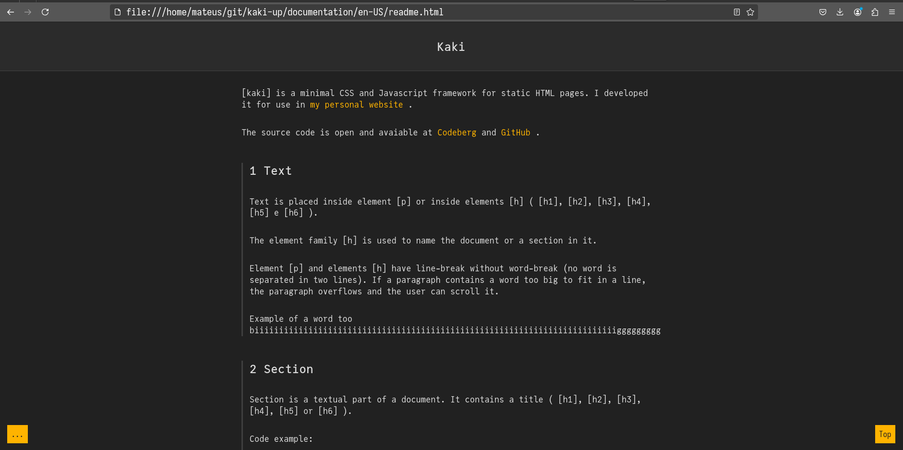

# kaki

Kaki is a minimalistic CSS and Javascript framework for use with static HTML pages. It can be used, for example, in a personal website (like my [own](https://kalamado.codeberg.page/)).

It can also be used to document projects. The HTML files in [documentation] use kaki. They contain further information.

The source code is open and avaiable at [Github](https://codeberg.org/kalamado/kaki) and [Codeberg](https://codeberg.org/kalamado/kaki).

Here is a screenshot of the page [documentation/en-US/readme.html]:

